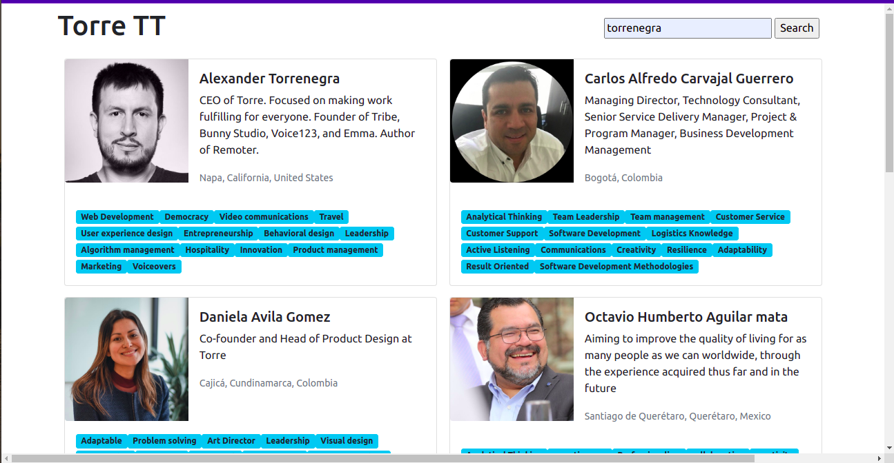

# Torre-tt

Torre-tt is a technical test project by Torre. The project is about building a page where you can search for a user and see their skills. When one skill is clicked, you should be able to view its details.

## Screenshots

## Built With

- HTML
- CSS
- JavaScript (ES6)

## Live Demo

[Live demo link](https://blaise-shyaka.github.io/torre-tt/)

## Getting Started
### Requirements

- Node >= v14

### To run the project locally

- Clone the [repository](https://github.com/Blaise-Shyaka/torre-tt.git)
- Run `npm install` to install dependencies
- Open `index.html` in your browser

## Authors

👤 **Blaise SHYAKA**
- Github: [@Blaise-Shyaka](https://github.com/Blaise-Shyaka)
- Twitter: [@blaiseshyaka95](https://twitter.com/blaiseshyaka95)
- Linkedin: [blaise-shyaka](https://www.linkedin.com/in/blaise-pascal-shyaka)

## 🤝 Contributing

Contributions, issues and feature requests are welcome! 

- Fork the project
- Clone the project to your local machine
- Create a new branch  `git checkout -b your-branch-name`
- Make your contributions
- Push your branch up to your forked repository
- Open a Pull Request with a detailed description to the development branch of the original project for a review

## Show your support

If you loved this project, please hit the ⭐️ button.